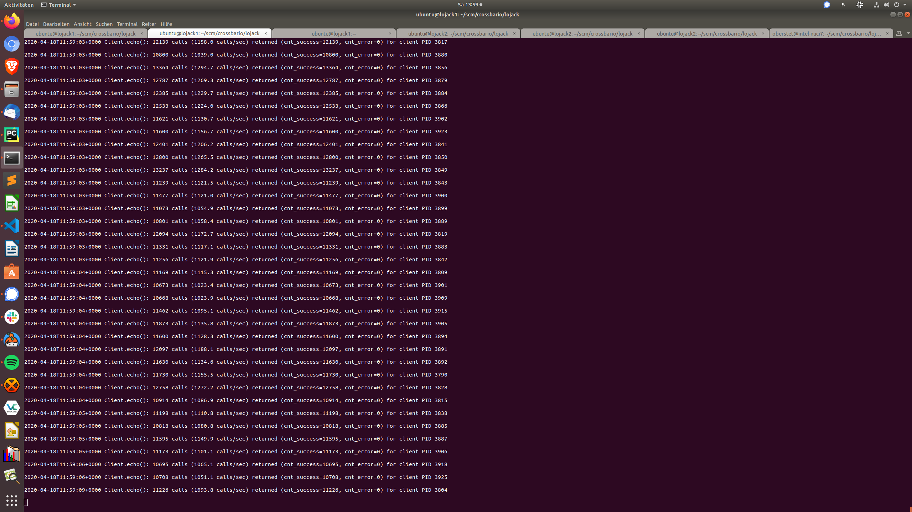

# Crossbar.io FX Test Bed

* [Node 1](https://lojack1.crossbario.com/info)

## Results

This test runs load clients on one machine, where the clients connect
over RawSocket-TCP (no TLS, CBOR serialization) and call a WAMP
procedure with 256 random bytes as the (single positional) argument.

The backend procedure called is running on the testee machine, and
simply returns the 256 random bytes provided as call argument.

Results:

* more than 150,000 WAMP calls/sec are performed by the load clients
* traffic runs over a real network (AWS internal) with almost 1Gb/s WAMP client (up+down) traffic
* CrossbarFX consumes 12 CPU cores and 6GB RAM
* the test was run constantly at full load for more than an hour with no errors
* memory consumption remained constant, the testee machine stable

### How to run

On **lojack2** (c5.4xlarge):

```
docker-compose up node2
```

and

```
docker-compose up backend
```

On **lojack1** (m5a.8xlarge):

```
(pypy3_1) ubuntu@lojack1:~/scm/crossbario/lojack$ pypy3 backend/client.py --url=rs://lojack2.crossbario.com:80 --parallel=16
```




## tldr;

Login:

```console
ssh ubuntu@lojack1.crossbario.com
source ~/cpy381_1/bin/activate
cd ~/scm/crossbario/lojack/
```

```console
ssh ubuntu@lojack2.crossbario.com
source ~/cpy381_1/bin/activate
cd ~/scm/crossbario/lojack/
```

Docker:

```console
docker ps

docker logs --tail 40 lojack_crossbarfx_config5_1
docker logs -f lojack_crossbarfx_config5_1

docker logs lojack_crossbarfx_config5_1 >& cb-logs1.txt

docker top lojack_crossbarfx_config5_1

docker exec -it lojack_crossbarfx_config5_1 bash
```

Crossbar:

```console
docker pull crossbario/crossbarfx:cpy-slim-amd64
docker run --rm crossbario/crossbarfx:cpy-slim-amd64 version

docker pull crossbario/crossbarfx:pypy-slim-amd64
docker run --rm crossbario/crossbarfx:pypy-slim-amd64 version

docker exec -it lojack_crossbarfx_config5_1 ls -la /node/.crossbar/

docker exec -it lojack_crossbarfx_config5_1 \
    /usr/local/bin/crossbarfx edge status --cbdir=/node/.crossbar
```

## Configuration

* Region: `us-east-1`
* AZ: `us-east-1c`
* Placement group: `crossbarfx`
* Instance type: `m5a.xlarge`

### Instances

* VM 1: `lojack1.crossbario.com` (`52.71.32.105`)

### TLS


## VSCode Jinja highlighting

* https://marketplace.visualstudio.com/items?itemName=samuelcolvin.jinjahtml
* https://github.com/samuelcolvin/jinjahtml-vscode
