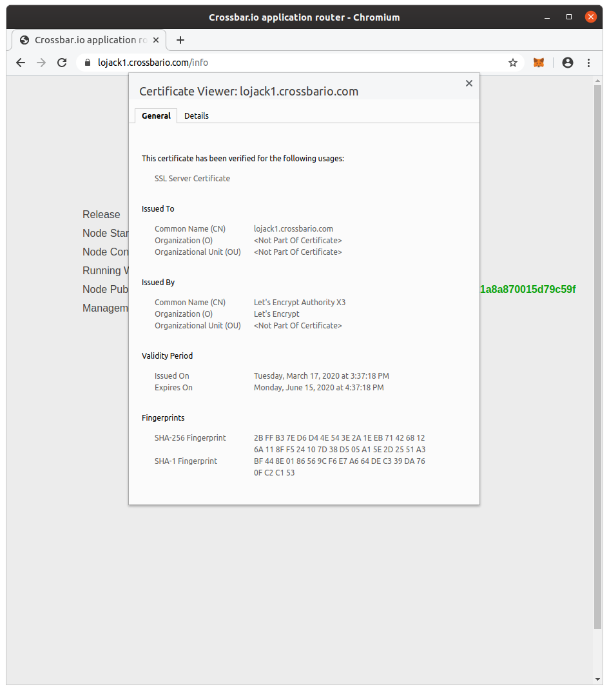

# Crossbar.io FX Test Bed

* [Node 1](https://lojack1.crossbario.com/info)

## tldr;

Login:

```console
ssh ubuntu@lojack1.crossbario.com
source ~/cpy381_1/bin/activate
cd ~/scm/crossbario/lojack/
```

Docker:

```console
docker ps

docker logs --tail 40 lojack_crossbarfx_config5_1
docker logs -f lojack_crossbarfx_config5_1

docker top lojack_crossbarfx_config5_1

docker exec -it lojack_crossbarfx_config5_1 bash
```

Crossbar:

```console
docker pull crossbario/crossbarfx:cpy-slim-amd64
docker run --rm crossbario/crossbarfx:cpy-slim-amd64 master version

docker pull crossbario/crossbarfx:pypy-slim-amd64
docker run --rm crossbario/crossbarfx:pypy-slim-amd64 master version

docker exec -it lojack_crossbarfx_config5_1 ls -la /node/.crossbar/

docker exec -it lojack_crossbarfx_config5_1 \
    /usr/local/bin/crossbarfx edge status --cbdir=/node/.crossbar
```

## Configuration

* Region: `us-east-1`
* AZ: `us-east-1c`
* Placement group: `crossbarfx`
* Instance type: `m5a.xlarge`

### Instances

* VM 1: `lojack1.crossbario.com` (`52.71.32.105`)

### TLS




## VSCode Jinja highlighting

* https://marketplace.visualstudio.com/items?itemName=samuelcolvin.jinjahtml
* https://github.com/samuelcolvin/jinjahtml-vscode
